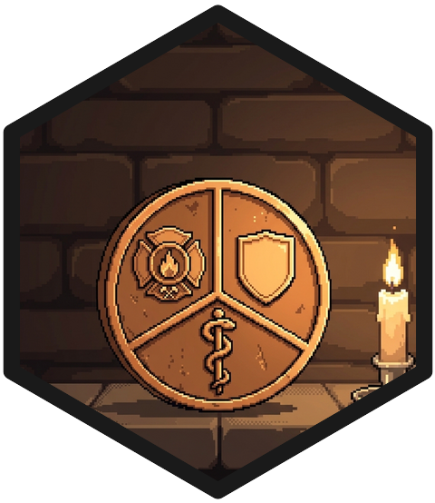
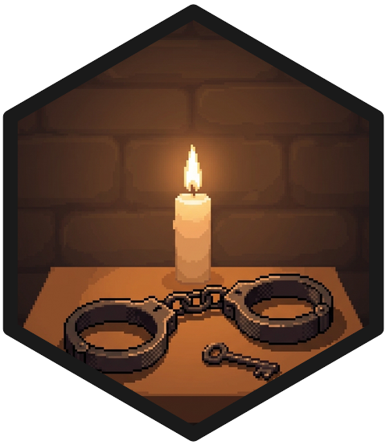

<div class="belt-bar--sm"></div>

I work in the Research Ring at the [ALERRT Center](https://alerrt.org), Texas State University. ALERRT trains law enforcement for active attacks. The Ring is the part of the building that asks awkward questions afterward, including about the people doing the responding. The team's current projects live on the [ALERRT Research site](https://www.alerrt-research.org). This page is the part of it that's my fault.

## First responder health and mortality {#health}

::: {.hex-mark .hex-mark--section}
{fig-alt="Pixel-art hex sticker: a firefighter's helmet on a stone ledge, three candles behind it burned to different heights."}
:::

This is the center of my work. First responders take on shift work, chronic stress, violence, and toxic exposures as conditions of the job, and the field has remarkably little population-level evidence about what a career of that does to a person. I work with death-certificate data to describe who dies of what, and how that compares with everyone else who works for a living. I measure health in the years before that with self-reports and biomarkers collected in the field. And I study the policies that shape first responder health, presumptive workers' compensation laws especially, because they decide which of those outcomes the law is willing to call work-related.

<ul class="worklist">
<li><span class="year">2025</span><span><a href="https://doi.org/10.1016/j.lana.2025.101270" class="work-title">Mortality among law enforcement officers in the United States: A population-wide analysis of the National Occupational Mortality Surveillance data, 2020–2023</a><span class="venue">The Lancet Regional Health – Americas</span></span></li>
<li><span class="year">2026</span><span><a href="https://doi.org/10.1016/j.lana.2025.101330" class="work-title">Clarifying methods and interpretations in law enforcement mortality surveillance: Response to Kamal</a><span class="venue">The Lancet Regional Health – Americas</span></span></li>
<li><span class="year">2026</span><span><span class="work-title">Correctional officer mortality in the United States, 2020–2023: Evidence from the National Occupational Mortality Surveillance program</span><span class="venue">American Journal of Public Health (in press)</span></span></li>
</ul>

## Police training and public opinion {#training}

::: {.hex-mark .hex-mark--section}
{fig-alt="Pixel-art hex sticker: a brass magnifying glass lying on a pinned sheet of parchment, a red string running from the pin."}
:::

ALERRT trains officers for the worst day of their careers, which gives us an unusually good seat for watching how people are taught to decide under pressure. I study the training itself: what transfers to the street, what evaporates in the parking lot, and how you would even measure the difference. I also study what the public makes of the decisions that come out the other end. Officers and civilians can watch the same encounter and describe two different events. Factorial survey experiments let us find the exact moment the stories diverge.

<ul class="worklist">
<li><span class="year">2026</span><span><a href="https://doi.org/10.1016/j.jcrimjus.2026.102601" class="work-title">Striking or grappling? Comparing public and officers' perceptions of police use of force</a><span class="venue">Journal of Criminal Justice</span></span></li>
<li><span class="year">2026</span><span><a href="https://doi.org/10.1016/j.jcrimjus.2025.102578" class="work-title">Public opinion and the immediate entry dilemma: A factorial survey experiment on active shooter response</a><span class="venue">Journal of Criminal Justice</span></span></li>
</ul>

## Where I came from {#origins}

::: {.hex-mark .hex-mark--section}
{fig-alt="Pixel-art hex sticker: a glass flask releasing a glowing DNA helix, a honeybee resting on the strand."}
:::

My CV reads like three careers stapled together, because it is. First a criminologist, studying the people who pass through the justice system. Then a biosocial researcher, spending a postdoc in a behavior-genetics lab on polygenic scores and DNA methylation: how the body registers social disadvantage, and how much of the "genetic effect" in observational studies is really something else. Now an occupational researcher of policing, studying the health, wellness, and training of police officers and the other first responders who work alongside them. The middle career is why I still think about health in biological terms, and why the first-responder work keeps reaching for blood samples when a survey would have been cheaper.

::: {.geb-figure}
{fig-alt="Cover of Gödel, Escher, Bach: a single carved wooden block lit from three directions, casting the shadows G, E, and B."}
:::

The habit I took from it is best explained by the cover of Hofstadter's *Gödel, Escher, Bach*: a single carved block that casts a different letter in each direction, depending on where you put the light. Genes, Environment, Behavior. Most research paradigms light two of the three and assume the third away. I have spent my career shifting the lamp around and asking what matters *from here*. And then from here. And then with two lamps at once. The first-responder work is that same habit pointed at a population that badly needs the attention.

<ul class="worklist">
<li><span class="year">2024</span><span><a href="https://doi.org/10.1177/21677026241260260" class="work-title">Do polygenic indices capture 'direct' effects on child externalizing behavior? Within-family analyses in two longitudinal birth cohorts</a><span class="venue">Clinical Psychological Science</span></span></li>
<li><span class="year">2023</span><span><a href="https://doi.org/10.1177/21677026231186802" class="work-title">Associations of DNA-methylation measures of biological aging with social disparities in child and adolescent mental health</a><span class="venue">Clinical Psychological Science</span></span></li>
</ul>

```{=html}
<a class="tree-card" href="skilltree.html">
  <svg class="tree-card-mark" viewBox="0 0 120 120" aria-hidden="true">
    <path class="tc-ring" d="M60,2.3L110,31.2L110,88.9L60,117.7L10,88.9L10,31.2Z"/>
    <path class="tc-ring" d="M60,21.5L93,40.5L93,79.5L60,98.5L27,79.5L27,40.5Z"/>
    <path class="tc-ring" d="M60,40.8L77,50.4L77,69.6L60,79.2L43,69.6L43,50.4Z"/>
    <path fill="#3FBDB6" d="M42,18.6L51,23.8L51,34.2L42,39.4L33,34.2L33,23.8Z"/>
    <path fill="#A47FE0" d="M42,80.6L51,85.8L51,96.2L42,101.4L33,96.2L33,85.8Z"/>
    <path fill="#E2574B" d="M96,49.6L105,54.8L105,65.2L96,70.4L87,65.2L87,54.8Z"/>
    <circle class="tc-origin" cx="60" cy="60" r="5"/>
  </svg>
  <span class="tree-card-text">
    <span class="eyebrow">Skill tree</span>
    <span class="tree-card-title">Every article, as one map.</span>
    <span class="tree-card-blurb">The papers above and all the rest, as hexes on rings by year, each pulled toward whichever of the three areas the work drew on. The lights are off in there. Bring your own.</span>
    <span class="tree-card-more">Open the tree &rarr;</span>
  </span>
</a>
```
